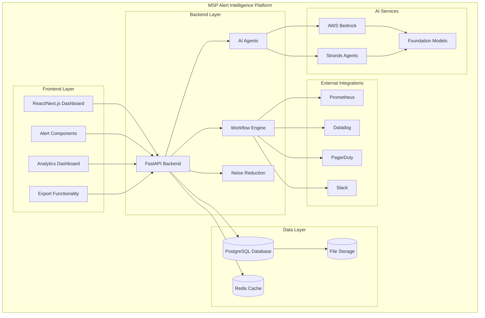
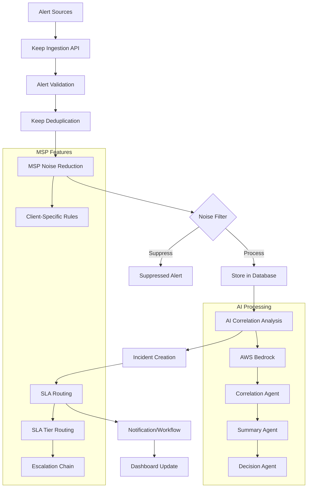
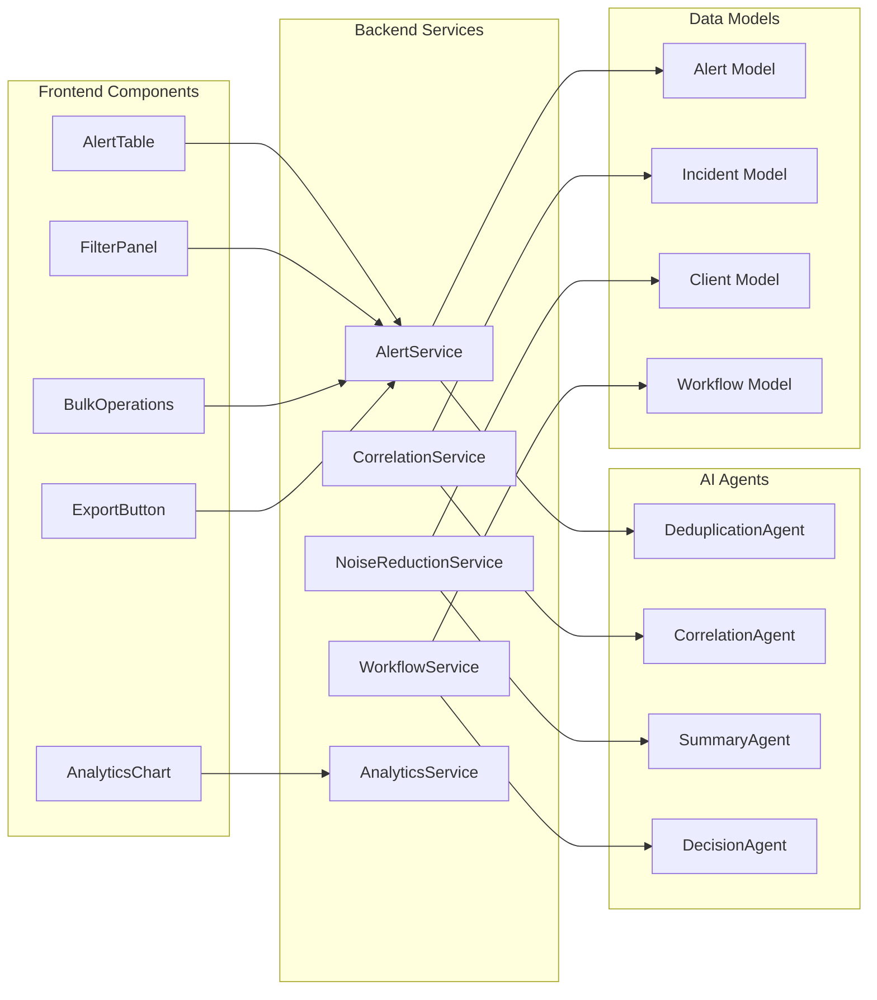
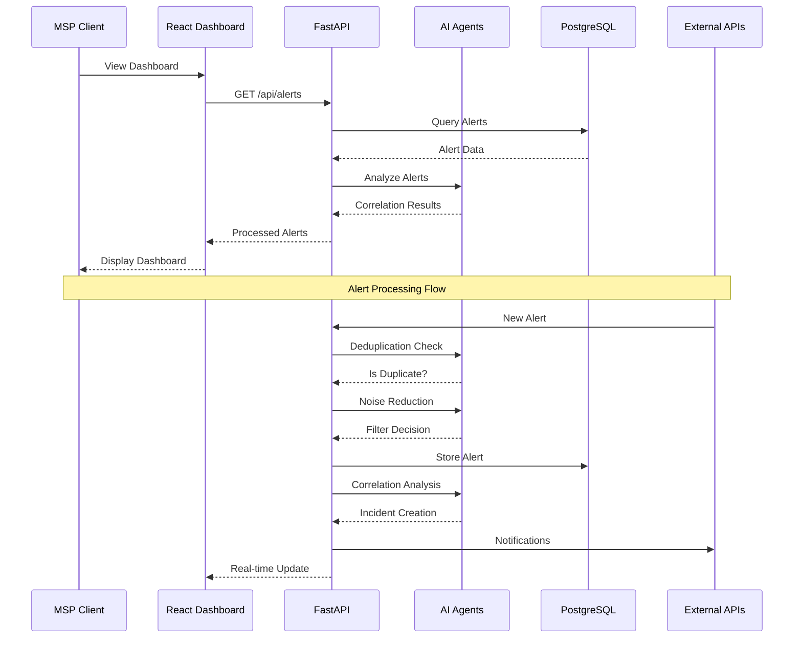
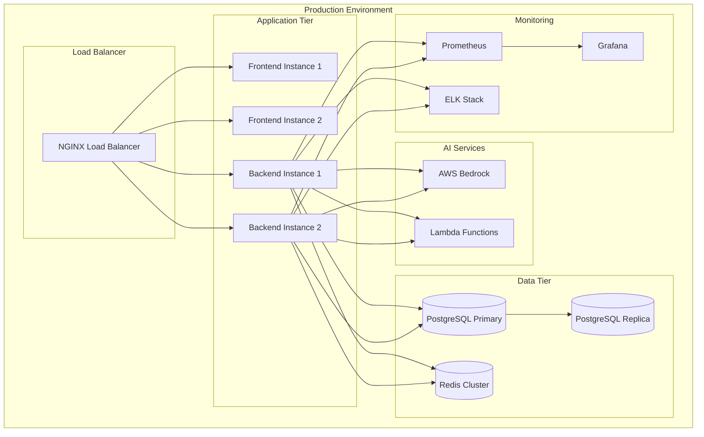
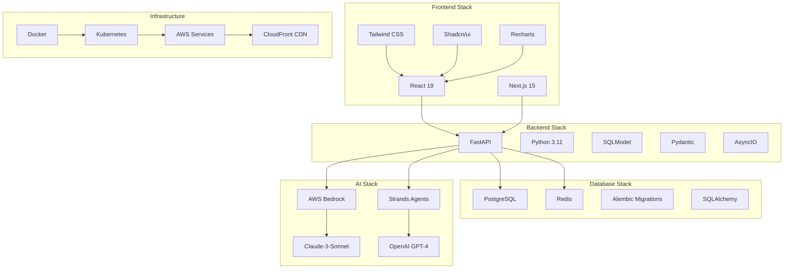
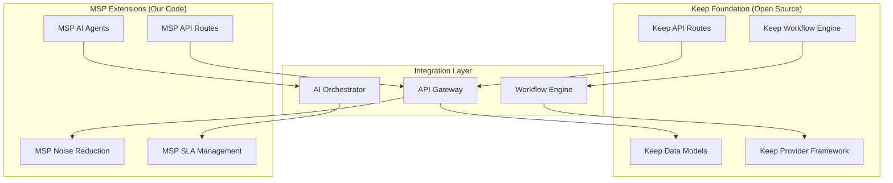
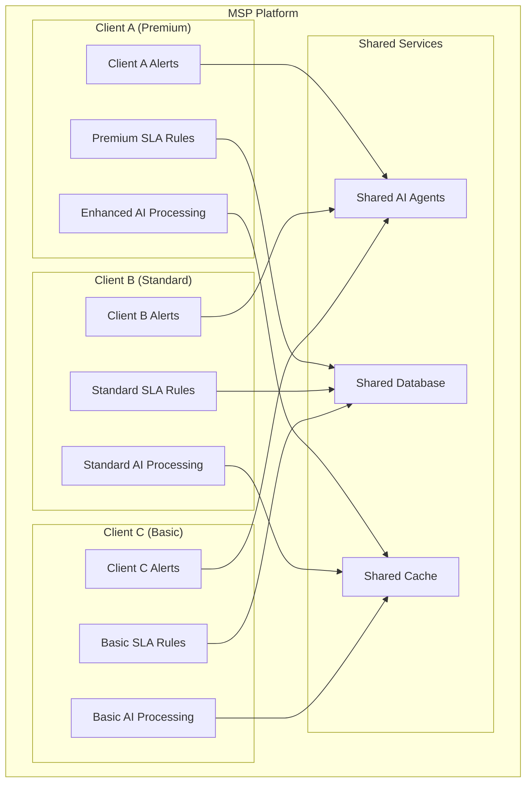
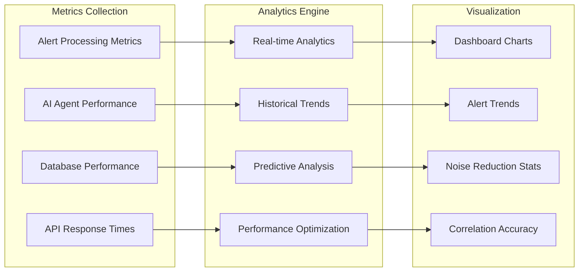

# MSP Alert Intelligence Platform - Architecture Diagrams

## High-Level System Architecture

## Alert Processing Pipeline

## Component Architecture

## Data Flow Architecture

## Deployment Architecture

## Technology Stack Architecture

## Keep Integration Architecture

## Client Multi-Tenancy Architecture

## Performance Metrics Architecture

---

## Usage Instructions

To use these Mermaid diagrams:

1. **Copy the diagram code** from any section above
2. **Paste into Mermaid Live Editor**: https://mermaid.live/
3. **Or use in documentation**: GitHub, GitLab, and many platforms support Mermaid
4. **Or use in presentations**: Export as PNG/SVG for slides

## Key Architecture Benefits

- **Modular Design**: Clear separation of concerns
- **Scalable Architecture**: Horizontal scaling capabilities
- **AI-First Approach**: Intelligent processing at every layer
- **MSP-Optimized**: Built specifically for managed service providers
- **Production-Ready**: Built on proven Keep foundation
- **Cloud-Native**: Designed for modern deployment environments
