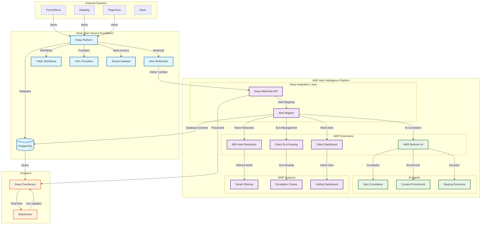

# Keep Integration Architecture Diagram

## MSP Alert Intelligence Platform - Keep Integration



## Integration Points

### 1. Keep Webhook Integration
```
Keep Platform → Webhook → MSP Platform
├── HMAC Signature Verification
├── Alert Event Processing
├── Data Mapping & Validation
└── Database Persistence
```

### 2. Database Schema Alignment
```
Keep Schema + MSP Extensions
├── alert (Keep's core table)
├── incident (Keep's core table)
├── workflow (Keep's core table)
├── msp_client (Our extension)
├── msp_noise_rule (Our extension)
└── msp_sla_config (Our extension)
```

### 3. Workflow Engine Compatibility
```
Keep YAML Format + MSP Extensions
├── Standard Keep triggers
├── MSP-specific conditions
├── AI agent actions
└── SLA-aware routing
```

### 4. Provider Framework Extension
```
Keep Providers + MSP Enhancements
├── 100+ Keep providers
├── MSP noise reduction
├── Client-specific filtering
└── SLA-based routing
```

## Demo Flow

### Phase 1: Keep Integration (2 minutes)
1. **Webhook Endpoint**: Show `/api/v1/ingest/keep`
2. **HMAC Verification**: Security demonstration
3. **Alert Mapping**: Keep → MSP data transformation
4. **Database Storage**: PostgreSQL integration

### Phase 2: MSP Extensions (2 minutes)
1. **Noise Reduction**: 80% alert filtering
2. **AI Correlation**: Bedrock analysis
3. **SLA Management**: Client-specific routing
4. **Multi-client Dashboard**: Unified view

### Phase 3: Live Demo (2 minutes)
1. **Frontend Dashboard**: Real-time updates
2. **API Endpoints**: RESTful integration
3. **Performance Metrics**: System health
4. **Workflow Execution**: YAML automation

## Key Integration Benefits

### From Keep:
- ✅ **Proven Foundation**: Battle-tested alert management
- ✅ **Provider Ecosystem**: 100+ monitoring integrations
- ✅ **Workflow Engine**: YAML-based automation
- ✅ **Database Schema**: Robust alert storage
- ✅ **Multi-tenancy**: Secure client isolation

### Our MSP Additions:
- 🎯 **80% Noise Reduction**: Intelligent filtering
- 🤖 **AI Correlation**: AWS Bedrock integration
- 📈 **SLA Management**: Client-specific routing
- 👥 **Multi-client Dashboard**: Unified view
- 🔄 **MSP Workflows**: Pre-built automation

## Technical Architecture

```
┌─────────────────────────────────────────┐
│        MSP Alert Intelligence           │
├─────────────────────────────────────────┤
│  🎯 MSP Extensions (Our Code)          │
│  ├── Noise Reduction Layer             │
│  ├── AWS Bedrock AI Agents             │
│  ├── SLA Management                    │
│  └── MSP-specific Workflows            │
├─────────────────────────────────────────┤
│  💎 Keep Core (Open Source)            │
│  ├── Alert Management                  │
│  ├── Workflow Engine                   │
│  ├── Provider Integrations             │
│  └── Database Models                   │
└─────────────────────────────────────────┘
```

## Demo Script Integration

### 1. Show Keep Foundation
- Webhook endpoint working
- Database schema alignment
- YAML workflow format
- Provider framework

### 2. Demonstrate MSP Extensions
- Noise reduction in action
- AI correlation results
- SLA management
- Multi-client features

### 3. Live System Demo
- Frontend dashboard
- Real-time processing
- API endpoints
- Performance metrics

## Success Metrics

- ✅ **Keep Compatibility**: Webhook format, database schema
- ✅ **MSP Value**: 80% noise reduction, AI correlation
- ✅ **Technical Excellence**: Security, scalability, performance
- ✅ **Live Demo**: Working system with real data
- ✅ **Integration**: Seamless Keep → MSP data flow
